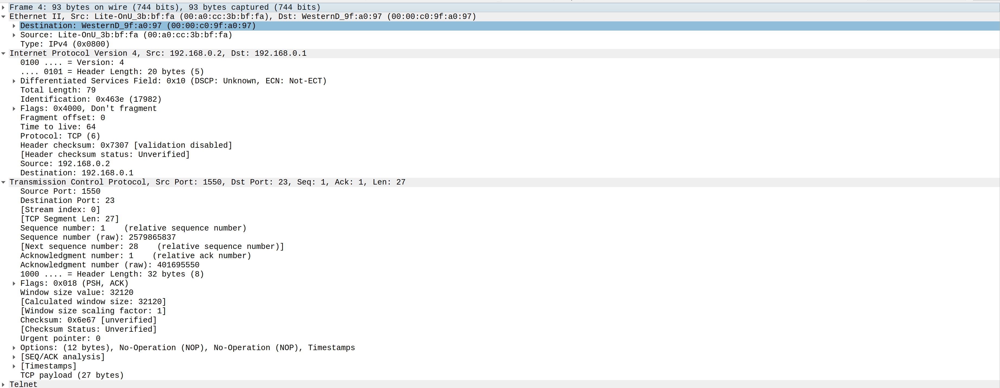

# ANALISIS DNS & TELNET CAP

    Nama		        : Rakha Putra Pratama
    NRP		        : 3122600013
    Kelas		        : 2 D4 IT A
    Mata Kuliah	        : Konsep Jaringan
    Dosen Pengampu	        : Dr. Ferry Astika Saputra S.T., M.Sc

## 1. ANALISIS TELNET

Telnet adalah sebuah protokol dalam jaringan yang memungkinkan akses dan pengendalian perangkat dari jarak jauh melalui jaringan. Umumnya, Telnet digunakan untuk masuk ke shell atau lingkungan baris perintah pada perangkat seperti server atau router yang terletak jauh dan mendukung koneksi jaringan.

Dalam penggunaannya, Telnet mengijinkan pengguna untuk menyambung ke perangkat jarak jauh dan berinteraksi dengan sistem tersebut seolah-olah mereka sedang berada di depan perangkat itu sendiri. Pengguna dapat memasukkan perintah, menjalankan program, serta melihat hasil keluaran dari perangkat jarak jauh ini melalui koneksi Telnet.

<strong>Gambar:</strong> 1 Gambar Wireshark untuk Telnet.cap

Dari situ, kita bisa mengidentifikasi alamat IP pengguna (192.168.0.2) dan alamat IP server/PC yang dihubungi dari jarak jauh (192.168.0.1), juga port yang dipakai oleh pengguna (1550) dan server/PC yang dihubungi (23) lewat protokol TCP untuk layanan Telnet.

Dalam Wireshark, kita bisa memantau aliran TCP atau apa yang terjadi dalam protokol tersebut. Garis merah menunjukkan data yang dikirim oleh pengguna (yang mengakses server/PC jarak jauh), sedangkan garis biru menandakan respon dari server/PC yang dihubungi.

## 2. ANALISIS DNS

DNS adalah singkatan dari "Domain Name System" (Sistem Nama Domain). Ini adalah sistem yang digunakan dalam jaringan komputer untuk mengubah nama domain yang mudah diingat (contoh: <a href="www.detik.com">www.detik.com</a>) menjadi alamat IP numerik yang diperlukan oleh komputer untuk berkomunikasi di internet. Dengan DNS, manusia bisa menggunakan nama domain yang mudah diingat saat mengakses situs web atau layanan online, sementara komputer menggunakan alamat IP untuk berkomunikasi dengan server yang sesuai.

<strong>Gambar:</strong> 1 Gambar Wireshark untuk DNS.cap

Keterangan tambahan dan parafrase: Dari data yang diberikan, kita bisa mengetahui alamat IP internet yang digunakan oleh klien dan server (klien: 192.168.170.8, server: 192.168.170.20), serta port yang dipakai oleh klien (32795) dan server (53).