# TUGAS MINGGU 2 | PRAKTIKUM

    Nama		        : Rakha Putra Pratama
    NRP		        : 3122600013
    Kelas		        : 2 D4 IT A
    Mata Kuliah	        : Konsep Jaringan
    Dosen Pengampu	        : Dr. Ferry Astika Saputra S.T., M.Sc

## TUGAS 1 -> ANALISIS FLOW GRAPH

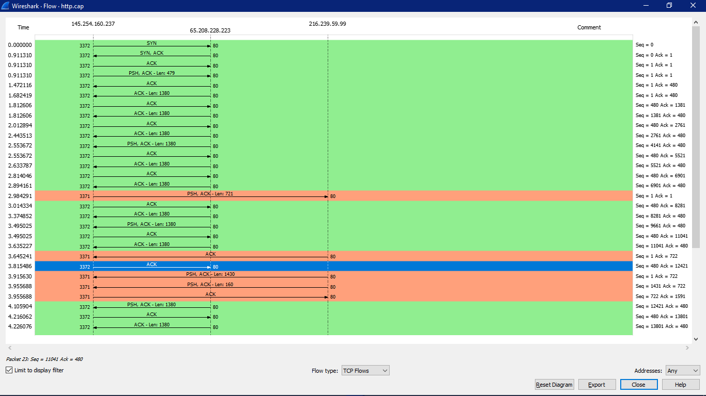

<strong>Gambar:</strong> 1.1 Flow Graph bagian 1

**Detik 0 - 1: Permulaan Permintaan HTTP**

1. **Detik 0**: User memasukkan URL situs web di Client dan menekan "Enter".
2. **Detik 1**: Client User menginisiasi koneksi dengan server tujuan menggunakan protokol TCP/IP. Proses ini melibatkan tiga langkah, yaitu perancangan koneksi, sinkronisasi urutan nomor urut, dan pertukaran informasi tentang ukuran jendela.

**Detik 2 - 3: Permintaan HTTP**

3. **Detik 2**: Setelah koneksi terbentuk, Client mengirimkan pesan SYN (synchronize) ke alamat IP server yang sesuai dan port 80 (port default untuk HTTP). Ini merupakan langkah pertama dalam proses TCP handshake.

4. **Detik 3**: User Client menerima pesan SYN-ACK dari server dan mengirimkan pesan ACK (acknowledge) sebagai tanggapan. Tahap ini menyelesaikan proses TCP handshake dan membuka koneksi TCP yang stabil antara peramban Anda dan server di port 80.

**Detik 4 - 8: Proses Server**

5. **Detik 4**: Setelah koneksi terbuka, User Client mengirimkan permintaan HTTP GET ke server untuk alamat URL yang diminta. Permintaan ini mencakup informasi seperti alamat URL lengkap dan header permintaan HTTP.

6. **Detik 5**: Jika sumber daya adalah halaman statis, server akan mengambil berkas tersebut dari sistem file atau memori cache, dan kemudian mempersiapkannya untuk pengiriman.

7. **Detik 6-7**: Jika sumber daya adalah halaman dinamis (misalnya, halaman web yang dihasilkan secara dinamis dari database), server akan menjalankan skrip atau program yang diperlukan untuk menghasilkan konten yang sesuai.

8. **Detik 8**: Server memasukkan konten yang dihasilkan ke dalam pesan respons HTTP, termasuk status kode (misalnya, 200 OK jika berhasil) dan header respons (seperti jenis konten dan panjang konten).

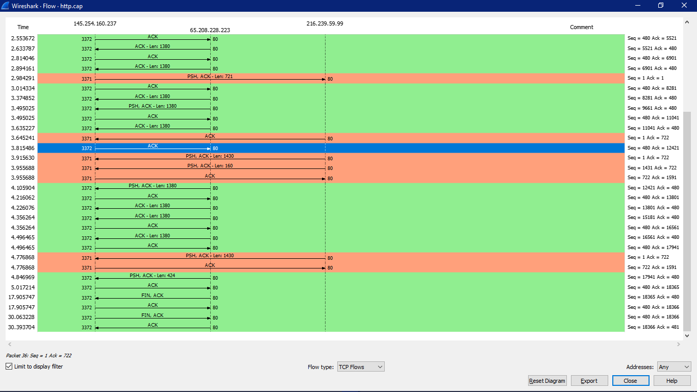

<strong>Gambar:</strong> 1.2 Flow Graph bagian 2 

**Detik 9 - 12: Pengiriman Respons HTTP**

9. **Detik 9**: Respons HTTP, yang berisi konten yang diminta, dikirimkan kembali ke Client User melalui koneksi TCP yang sama.

10. **Detik 10**: Client User menerima respons HTTP dan memulai penguraian respons.

11. **Detik 11**: Jika respons berisi halaman HTML, Client User mulai memproses kode HTML, menampilkan teks, gambar, dan elemen lainnya secara bertahap.

12. **Detik 12**: Selama proses penguraian, Client User juga akan mengambil sumber daya tambahan yang diperlukan, seperti gambar, CSS, atau JavaScript yang disebutkan dalam kode HTML. Ini mungkin melibatkan permintaan tambahan ke server untuk mengunduh sumber daya ini.

**Detik 17 - 30: Menampilkan Halaman Web**

13. **Detik 17-30**: Selama Tahap ini, peramban Anda terus memuat dan menampilkan konten halaman web yang dihasilkan oleh server. Ini mencakup tindakan seperti memuat gambar, CSS, JavaScript, dan sumber daya lain yang diperlukan untuk menampilkan halaman dengan benar. Jika ada permintaan tambahan, mereka akan terjadi melalui koneksi TCP yang sama pada port 80.

## TUGAS 2 -> ANALISIS PACKET COUNTER

<strong>Gambar:</strong> 1 Tampilan Packet Counter 

> **Packet Counter pada http.cap**

Packet Counter merupakan alat yang membantu memahami apa yang sedang terjadi di jaringan internet dengan menghitung dan menampilkan paket atau frame dalam sebuah capture atau sesi pemantauan jaringan. 
Adapun informasi penting terkait lalu lintas jaringan yang diberikan yaitu jumlah total packet, laju masuk paket, distribusi paket, burst rate, waktu awal burst.

Dari capture Packet Counter di atas, dapat disimpulkan bahwa ada 4 paket HTTP yang direkam, semuanya terkait dengan lalu lintas HTTP. Dari 4 paket ini, 2 adalah permintaan (request) HTTP yang semuanya menggunakan metode GET. Sisanya adalah respon dari server web, dengan semua respon memiliki kode status HTTP dalam kategori 2xx (keberhasilan), khususnya "200 OK". Burst rate untuk baik permintaan GET maupun respon adalah 0.0100 paket per detik, dengan burst rate pertama kali dimulai pada saat yang berbeda (0.911 detik untuk permintaan GET dan 3.956 detik untuk respon). Laju masuk rata-rata adalah 0.0005 paket per milidetik. Jadi, capture ini menunjukkan bahwa terdapat pertukaran data HTTP yang terutama terdiri dari permintaan GET dan respon 200 OK yang berhasil.

## TUGAS 3 -> ANALISIS TROUGHPUT

Troughput merujuk pada jumlah data yang berhasil ditransfer melalui jaringan dalam waktu tertentu. Anda dapat menggunakan Wireshark untuk mengamati throughput dalam berbagai skenario, seperti transfer file atau aktivitas web.

> **Isi dari Troughput:**

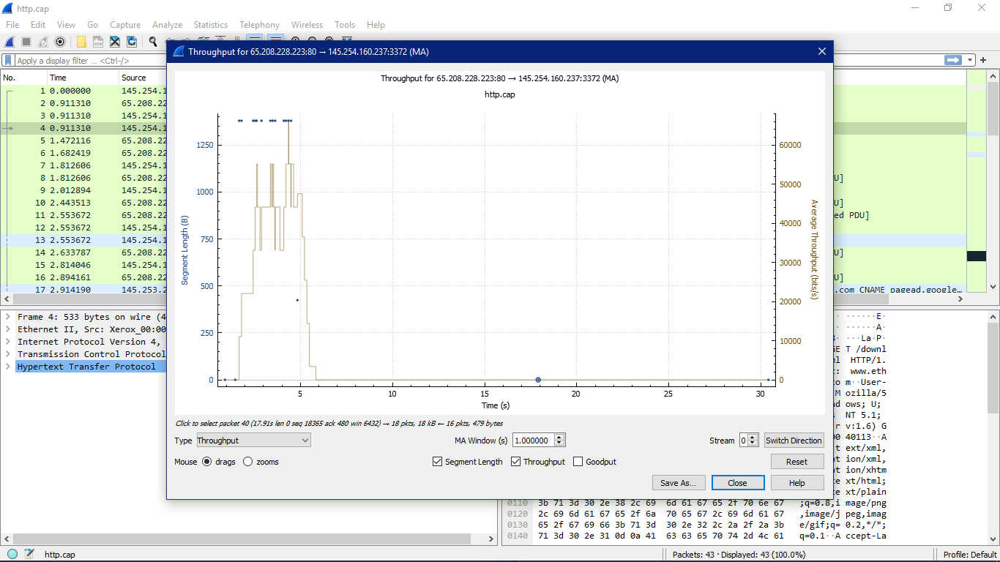

<strong>Gambar:</strong> 1.1 Troughput

1. Tabel: Tabel ini seperti daftar yang berisi informasi. Di dalamnya, ada data tentang paket-paket yang dikirim melalui jaringan. Setiap paket memiliki tiga hal penting yang dicatat:

	1.1. Panjang Paket: Ini menunjukkan seberapa besar paketnya, dalam ukuran byte.

	1.2. Nomor Urutan: Setiap paket memiliki "nomor urutan" yang membantu mengurutkannya.

	1.3. Nomor Pengakuan: Ini adalah nomor yang mengatakan, "Ya, aku menerimanya." Ini penting untuk mengonfirmasi bahwa paket sudah sampai.

2. Kurva: Kurva ini seperti garis yang menunjukkan bagaimana data berubah seiring waktu. Di sini, itu menunjukkan bagaimana banyak data yang dikirimkan pada setiap waktu.

Di dalam tabe itu bisa melihat berapa besar paket dan nomor-nomornya. Juga bisa melihat nomor pengakuan yang mengatakan bahwa paket sudah diterima.

Dalam kurva itu bisa melihat bagaimana data itu berubah seiring waktu. Misalnya bisa melihat bahwa ada waktu ketika banyak data dikirim dan waktu ketika sedikit data dikirim.

Sebagai contoh: 
Ketika kita meng-hover salah satu packet, kita bisa melihat informasi seperti:

> **1. Packet: 38**  
> **2. Time: 4.875s** 
> **3. Length: 424** 
> **4. Sequence Number : 17941** 
> **5. Acknowledgement Number : 480** 
> **6. Win : 6432**

## TUGAS 4 -> CARA MENEMUKAN GAMBAR DI HTTP_WITP_JPEGS.CAP

> **http_witp_jpegs.cap**

Berikut ini adalah cara untuk menemukan gambar yang ada di dalam file http_witp_jpegs.cap:

`1. Buka file http_witp_jpegs.cap`  

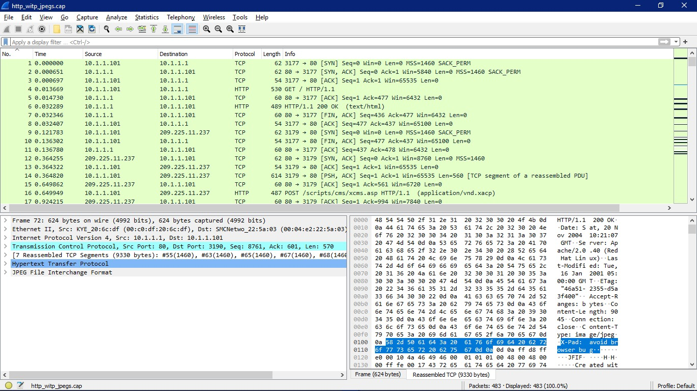

<strong>Gambar:</strong> 1.1 Tampilan Awal File

`2. Tambahkan filter dengan keyword "http" agar yang tampil list http protocol saja`  

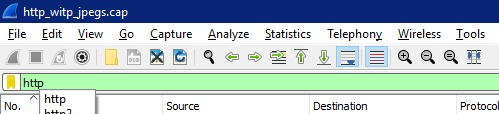

<strong>Gambar:</strong> 1.2 Filtering Protocol

`3. Lalu cari Frame 61, 72, 259, 269, 479`  

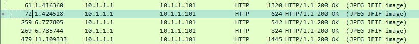

<strong>Gambar:</strong> 1.3 Frame yang Mengandung Gambar

`4. Klik kanan pada "JPEG File Intercharge Format lalu Show Packet Bytes"`  

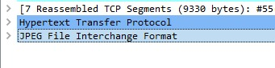
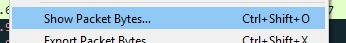

<strong>Gambar:</strong> 1.4 Klik Kanan & Show Packet Bytes

`5. Berikut tampilan isi dari tiap-tiap frame`  

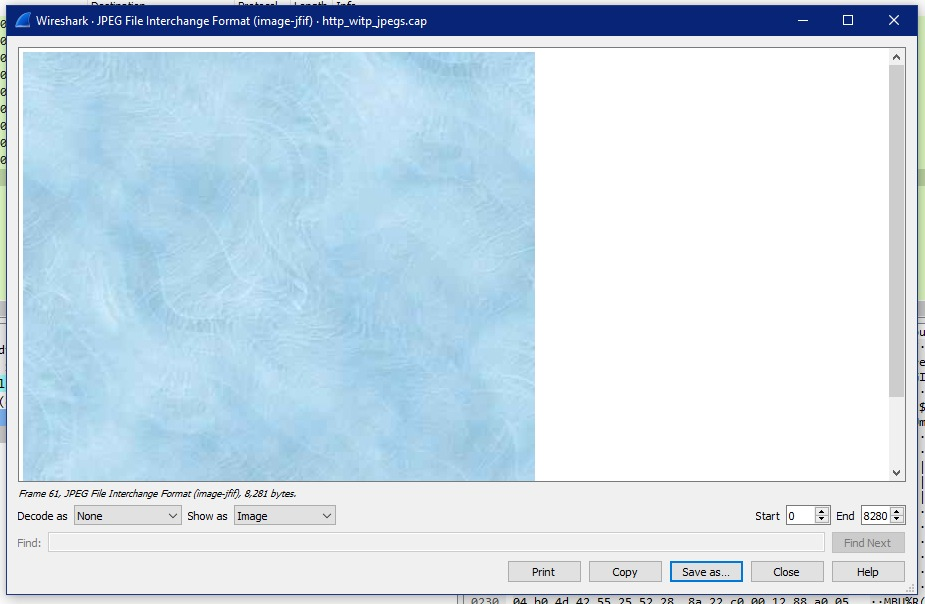

<strong>Gambar:</strong> 1.5 Frame 61

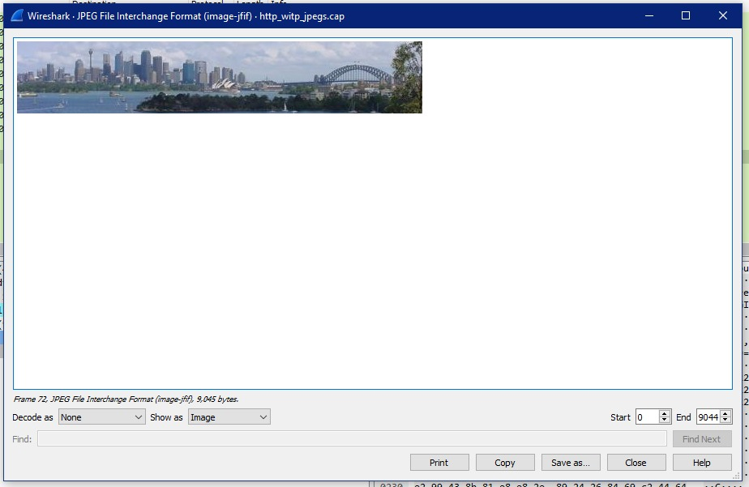

<strong>Gambar:</strong> 1.6 Frame 72

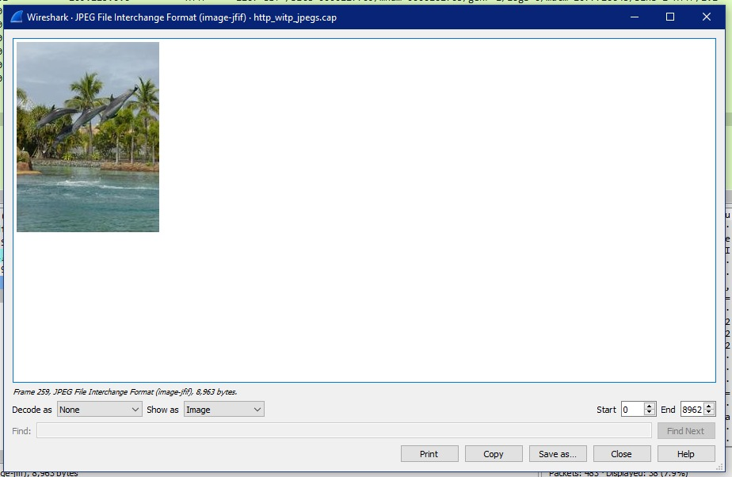

<strong>Gambar:</strong> 1.7 Frame 259

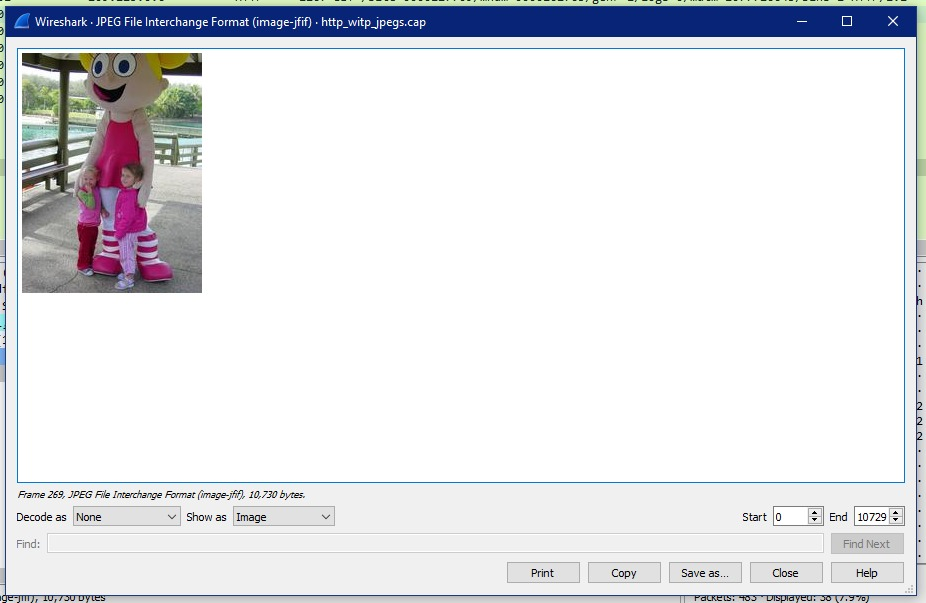

<strong>Gambar:</strong> 1.8 Frame 269

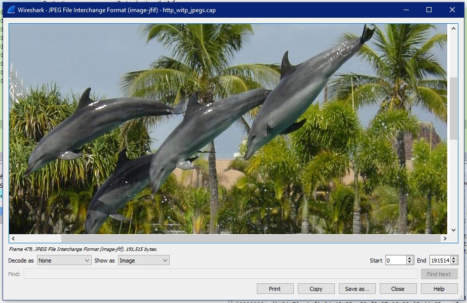

<strong>Gambar:</strong> 1.9 Frame 479

## TUGAS 5 -> MELANJUTKAN PROSES DATA TRANSFER

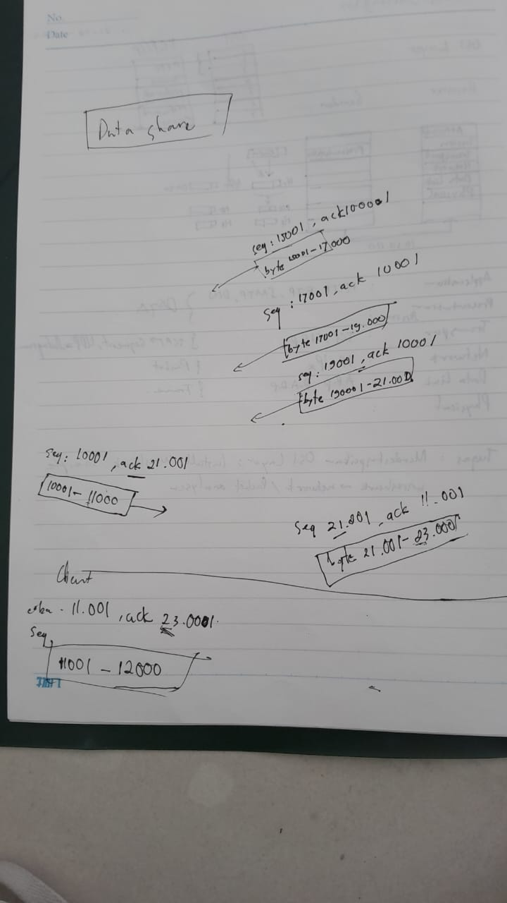

<strong>Gambar:</strong> 2.0 Melanjutkan Proses Data Transfer

