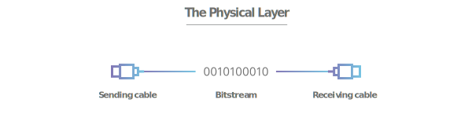
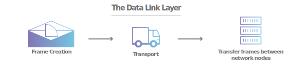
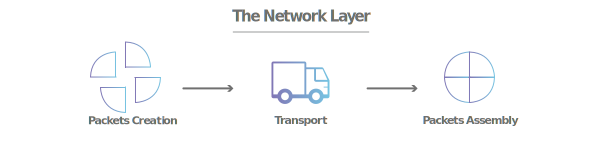
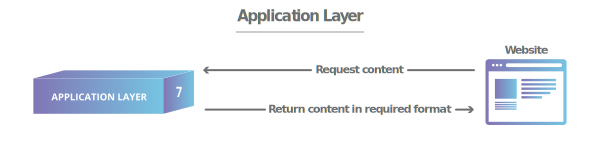

# FUNGSI OSI LAYER

**Nama :** Rakha Putra Pratama  
**Kelas :** 2 D4 IT A  
**NRP :** 3122600005  
**Mata Kuliah :** Konsep Jaringan  

##  1. Physical Layer

<strong>Gambar:</strong> Physical Layer.

-   **Fungsi:** Bertanggung jawab untuk mentransmisikan bit-bit dalam media fisik seperti kabel, serat optik, atau gelombang radio.
-   **Contoh Penerapan:** Mengirimkan sinyal listrik melalui kabel Ethernet.

##  2. Data Link Layer 

<strong>Gambar:</strong> Data Link Layer.

-   **Fungsi:** Menangani pengiriman data secara langsung antara dua perangkat yang terhubung dalam satu segmen jaringan.
-   **Contoh Penerapan:** Ethernet memastikan pengiriman data yang andal dalam sebuah jaringan lokal.

##  3. Network Layer 

<strong>Gambar:</strong> Network Layer.

-   **Fungsi:** Bertanggung jawab untuk mengarahkan paket data dari sumber ke tujuan melalui jaringan yang berbeda.
-   **Contoh Penerapan:** Protokol IP (Internet Protocol) mengatur pengiriman paket data melalui jaringan global.

##  4. Transport Layer 

<strong>Gambar:</strong> Transport Layer.

-   **Fungsi:** Menangani kontrol aliran data, pembuatan dan penghancuran koneksi, serta pemisahan data menjadi segmen-segmen.
-   **Contoh Penerapan:** TCP (Transmission Control Protocol) memastikan pengiriman data yang terjamin dan terurut dalam aplikasi seperti browsing web.

##  5. Session Layer 

<strong>Gambar:</strong> Session Layer.

-   **Fungsi:** Mengelola pembuatan, pemeliharaan, dan pengakhiran sesi komunikasi antara aplikasi di dua perangkat.
-   **Contoh Penerapan:** Lapisan sesi membantu dalam pembentukan dan penghentian sesi saat Anda melakukan panggilan video konferensi.

##  6. Presentation Layer

<strong>Gambar:</strong> Presentation Layer.

-   **Fungsi:** Menangani enkripsi, kompresi, dan konversi format data agar bisa dipahami oleh aplikasi yang berbeda.
-   **Contoh Penerapan:** Mengenkripsi data sensitif sebelum mengirimnya melalui jaringan.

##  7. Application Layer

<strong>Gambar:</strong> Application Layer.

-   **Fungsi:** Memberikan layanan komunikasi langsung kepada aplikasi pengguna.
-   **Contoh Penerapan:** Protokol HTTP digunakan untuk mengakses halaman web melalui browser.