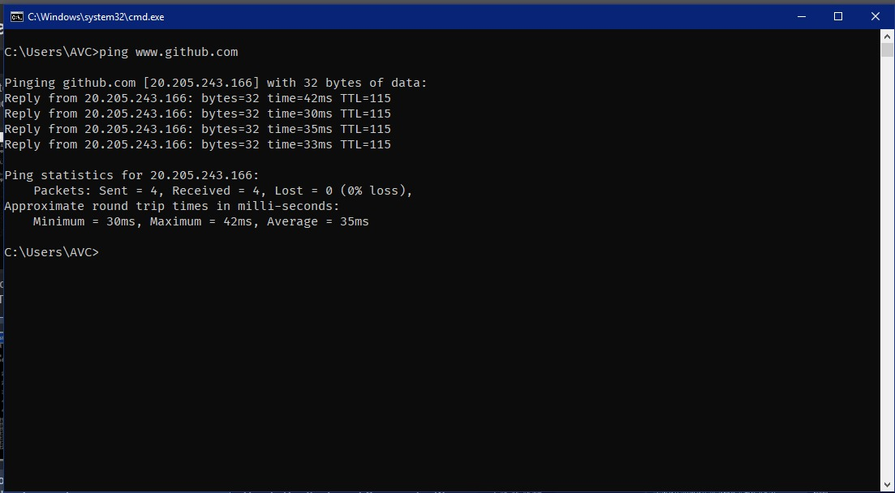
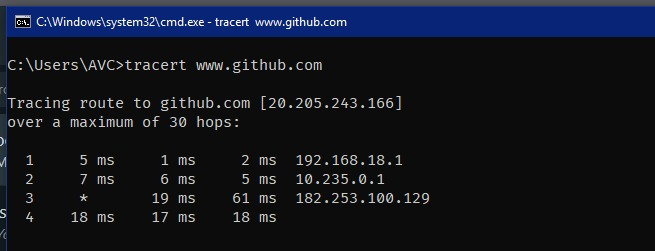

# PING & TRACE ROUTE

### 1. PING

<strong>Gambar:</strong> Pinging Github

Ping adalah perintah dalam jaringan komputer yang digunakan untuk menguji ketersediaan dan latensi (waktu tempuh) dari perangkat atau host di dalam jaringan. Pengujian ini dilakukan dengan mengirimkan paket sinyal (ICMP Echo Request) ke host target dan kemudian menerima balasan (ICMP Echo Reply) dari host tersebut. Ini memungkinkan Anda untuk mengukur seberapa cepat sinyal sampai ke host dan kembali

> #### CARA KERJA
1. Komputer pengirim mengirimkan paket ICMP Echo Request ke host target dengan mengisi header dan payload yang sesuai.
Host target menerima paket dan memprosesnya.
Host target merespons dengan mengirimkan paket ICMP Echo Reply ke komputer pengirim.
Komputer pengirim menerima balasan dan menghitung waktu yang diperlukan untuk paket pergi dan kembali. Waktu ini disebut sebagai "round-trip time" (RTT).

2. Host target menerima paket dan memprosesnya.

3. Komputer pengirim menerima balasan dan menghitung waktu yang diperlukan untuk paket pergi dan kembali. 

4. Waktu ini disebut sebagai "round-trip time" (RTT).

### 2. TRACE ROUTE

<strong>Gambar:</strong> Tracert Github

(tracert pada Windows atau traceroute pada sistem Unix) adalah perintah lain dalam jaringan yang digunakan untuk melacak jalur yang diambil oleh paket data dari komputer pengirim ke komputer tujuan melalui jaringan. Ini membantu dalam mengidentifikasi semua perangkat jaringan (router) yang dilewati oleh paket data dan melihat berapa lama setiap router memerlukan untuk meneruskan paket.

> #### CARA KERJA

1. Komputer pengirim mengirimkan serangkaian paket ke host tujuan, dengan setiap paket diberi "Time to Live" (TTL) yang berbeda.

2. Setiap router yang dilalui mengurangi TTL dalam paket. Jika TTL mencapai nol, router tersebut membuang paket dan mengirimkan pesan ICMP Time Exceeded kepada komputer pengirim.

3. Router terakhir yang mencapai host tujuan akan memberikan balasan normal.

4. Komputer pengirim menerima informasi tentang setiap router yang dilewati dan waktu yang diperlukan untuk paket mencapai setiap router.

 

> `Ping dan Trace Route: penting kelola jaringan & deteksi masalah.`

> `Ping: informasi ketersediaan & latensi.`

> `Trace Route: identifikasi jalur data` 