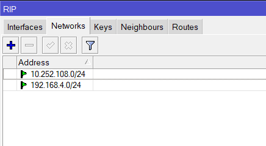
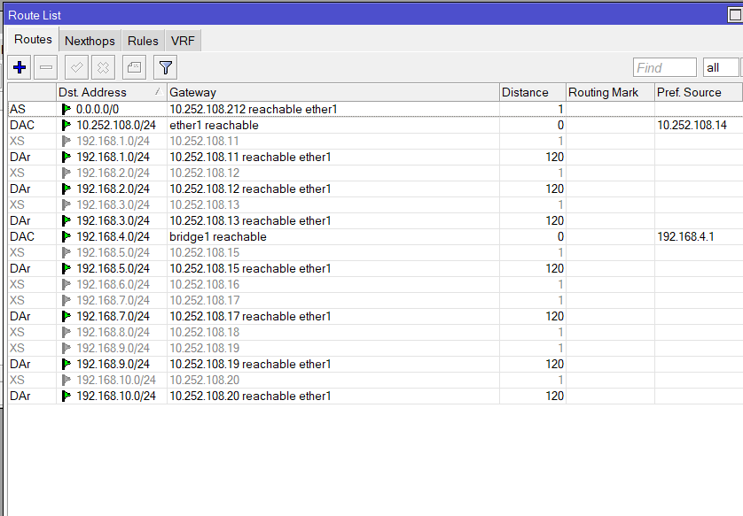

    Nama		        : Rakha Putra Pratama
    NRP		        : 3122600005
    Kelas		        : 2 D4 IT A
    Mata Kuliah	        : Konsep Jaringan
    Dosen Pengampu	        : Dr. Ferry Astika Saputra S.T., M.Sc

### Traceroute ke 1.1.1.1

#### Hop 1: 192.168.4.1

- **Hasil :**

  ```
  1.1.1.1

  1    <1 ms    <1 ms    <1 ms  192.168.4.1
  2    <1 ms    <1 ms    <1 ms  10.252.108.212
  3    <1 ms     1 ms    <1 ms  241.56.pens.ac.id [103.24.56.241]
  4     2 ms    <1 ms     1 ms  core-router.pens.ac.id [202.9.85.1]
  5     1 ms     1 ms     1 ms  edge-router.pens.ac.id [10.252.0.1]
  6     2 ms     2 ms     2 ms  114-4-97-169.resources.indosat.com [114.4.97.169]
  7    25 ms    23 ms    25 ms  114-0-78-196.resources.indosat.com [114.0.78.196]
  8    24 ms    23 ms    23 ms  13335.sgw.equinix.com [27.111.228.132]
  9    37 ms    25 ms    25 ms  162.158.39.3
  10    25 ms    25 ms    24 ms  one.one.one.one [1.1.1.1]

  ```

- Waktu respons sangat cepat, <1 ms. Ini menunjukkan bahwa hop ini adalah router atau perangkat jaringan lokal yang berdekatan dengan titik awal.

#### Hop 2: 10.252.108.212

- Respons yang sangat cepat, <1 ms. Kemungkinan merupakan perangkat jaringan lokal atau router.

#### Hop 3: 241.56.pens.ac.id [103.24.56.241]

- Respons yang sangat cepat, <1 ms. Nampaknya merupakan alamat IP dari sebuah lembaga pendidikan (PENS).

#### Hop 4: core-router.pens.ac.id [202.9.85.1]

- Respons yang baik, 1 ms. Kemungkinan merupakan router inti di lembaga pendidikan.

#### Hop 5: edge-router.pens.ac.id [10.252.0.1]

- Respons yang baik, 1-2 ms. Mungkin merupakan router tepi di lembaga pendidikan.

#### Hop 6: 114-4-97-169.resources.indosat.com [114.4.97.169]

#### Hop 7: 114-0-78-196.resources.indosat.com [114.0.78.196]

#### Hop 8: 13335.sgw.equinix.com [27.111.228.132]

- Seluruh hop ini menunjukkan respon yang baik, walaupun pada percobaan kedua dan ketiga, Hop 8 mengalami time-out. Mungkin ada konfigurasi di hop ini yang mencegah respons terhadap traceroute.

#### Hop 9: 162.158.39.3

#### Hop 10: one.one.one.one [1.1.1.1]

- Respon yang baik, sekitar 25 ms. Ini adalah server DNS 1.1.1.1 dari Cloudflare.

### Traceroute ke detik.com

 **Hasil :**

  ```
  detik.com

  1    <1 ms    <1 ms    <1 ms  192.168.4.1
  2    <1 ms    <1 ms    <1 ms  10.252.108.212
  3    <1 ms    <1 ms    <1 ms  241.56.pens.ac.id [103.24.56.241]
  4     1 ms    <1 ms    <1 ms  core-router.pens.ac.id [202.9.85.1]
  5     2 ms     1 ms     1 ms  edge-router.pens.ac.id [10.252.0.1]
  6    14 ms    14 ms    13 ms  124-195-38-7.resources.indosat.com [124.195.38.7]
  7    15 ms    17 ms    14 ms  123.108.8.172
  8    13 ms    14 ms    14 ms  s211-cast-211-221-49-103.detik.com [103.49.221.211]

  ```

#### Hop 1 - Hop 5

- Respons yang baik, <2 ms, melalui jaringan lokal dan lembaga pendidikan.

#### Hop 6: 124-195-38-7.resources.indosat.com [124.195.38.7]

#### Hop 7: 123.108.8.172

#### Hop 8: s211-cast-211-221-49-103.detik.com [103.49.221.211]

- Respon yang baik, sekitar 14-18 ms. Ini adalah server detik.com.

### Kesimpulan:

- Sebagian besar hop menunjukkan respons yang baik dan sesuai dengan harapan.
- Beberapa time-out pada hop tertentu (terutama Hop 8) mungkin disebabkan oleh kebijakan konfigurasi di perangkat jaringan tersebut.
- Jarak geografis dan jenis layanan mungkin mempengaruhi waktu respons antar hop.
- Meskipun terdapat beberapa time-out, jika pengguna tidak mengalami masalah koneksi atau kinerja, ini mungkin dapat diabaikan.
- Jika ada masalah koneksi atau kinerja yang dirasakan, langkah selanjutnya adalah berkoordinasi dengan penyedia layanan internet atau administrator jaringan setempat untuk menilai dan mengatasi masalah tersebut.


### IP Route Print :

<div align="center">

<p><strong>Gambar :</strong> IP Route</p>
</div>

### Route List :

<div align="center">

<p><strong>Gambar :</strong> Route List Gateaway</p>
</div>

### RIP Interfaces Configuration :

<div align="center">

<p><strong>Gambar :</strong> RIP Interface</p>
</div>

### RIP Networks Configuration :

<div align="center">

<p><strong>Gambar :</strong> RIP Interface</p>
</div>

### Dynamic Route List :

<div align="center">

<p><strong>Gambar :</strong> Dynamic Route List</p>
</div>
