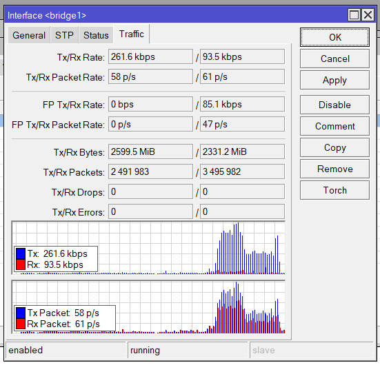
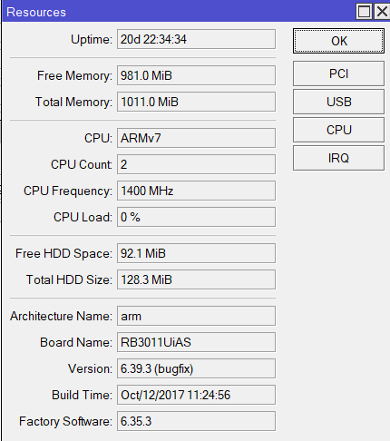
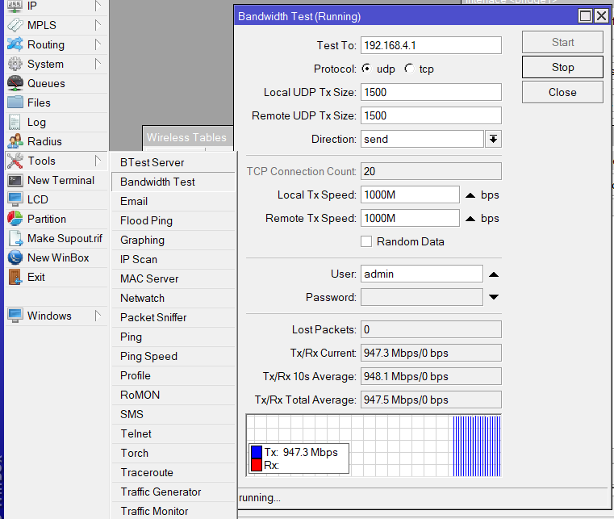
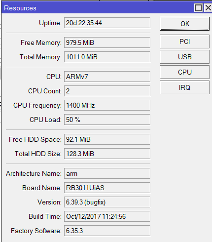

    Nama		        : Rakha Putra Pratama
    NRP		        : 3122600005
    Kelas		        : 2 D4 IT A
    Mata Kuliah	        : Konsep Jaringan
    Dosen Pengampu	        : Dr. Ferry Astika Saputra S.T., M.Sc
    
# Bandwith Test Server

### **1. Setting Bridge 1 dan Ping Test Traffic**

<strong>Gambar :</strong> Setting Bridge 1 & Ping Test

> Pertama, lakukan konfigurasi pada Bridge 1 untuk mengatur alur lalu lintas. Pastikan antarmuka yang terlibat sudah ditambahkan ke dalam bridge.

> Selanjutnya, lakukan uji ping untuk memastikan konektivitas antar perangkat yang terhubung ke Bridge 1.

### **2. CPU Load Sebelum Bandwidth Test**

<strong>Gambar :</strong> CPU Load Sebelum Bandwidth Test

> Sebelum melakukan uji bandwidth, periksa beban CPU pada perangkat. Ini memberikan gambaran awal tentang kinerja perangkat sebelum adanya beban tambahan.

### **3. Proses Bandwidth Test**

<strong>Gambar :</strong> Proses Bandwidth Test

### **4. CPU Load Setelah Bandwidth Test**

<strong>Gambar :</strong> CPU Load Setelah Bandwidth Test

> Setelah selesai melakukan uji bandwidth, periksa kembali beban CPU pada perangkat untuk mengevaluasi dampak dari uji bandwidth tersebut.
