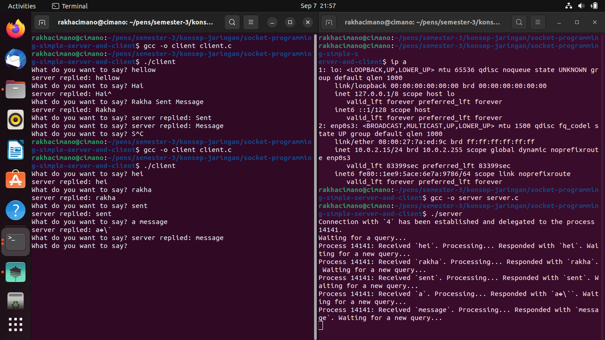

    Nama		        : Rakha Putra Pratama
    NRP		        : 3122600005
    Kelas		        : 2 D4 IT A
    Mata Kuliah	        : Konsep Jaringan
    Dosen Pengampu	        : Dr. Ferry Astika Saputra S.T., M.Sc

# SOCKET PROGRAMMING COMMUNICATION

<strong>Gambar:</strong> Proses Komunikasi Client & Server

1. **Variabel-variabel**: Kode ini menetapkan beberapa variabel yang akan digunakan dalam program, seperti sockfd (file descriptor untuk soket), portno (nomor port yang akan digunakan untuk menghubungkan ke server), dan buffer (tempat untuk mengirim dan menerima data).

2. **Membuat Soket**: Kode ini menggunakan fungsi 'socket' untuk membuat soket. Fungsi ini menghasilkan deskriptor berkas yang akan digunakan untuk komunikasi jaringan. Soket yang dibuat adalah soket TCP (SOCK_STREAM) dalam domain AF_INET (IPv4).

3. **Mendapatkan Informasi Server**: Kode ini menggunakan 'gethostbyname' untuk mendapatkan informasi tentang server yang akan dihubungi. Pada contoh ini, server yang dihubungi adalah 127.0.0.1 (localhost), sehingga alamat IP tersebut digunakan.

4. **Menginisialisasi Struktur serv_addr**: Struktur 'serv_addr' digunakan untuk menyimpan alamat server yang akan dihubungi. Kode ini mengisi struktur tersebut dengan alamat IP server dan nomor port yang telah ditentukan.

5. **Menghubungkan ke Server**: Kode ini menggunakan 'connect' untuk menghubungkan klien ke server yang telah ditentukan. Jika koneksi berhasil, klien akan terhubung ke server.

6. **Loop Komunikasi**: Setelah terhubung ke server, klien memasuki loop tak terbatas untuk berkomunikasi dengan server. Tahapan dalam loop ini adalah:

      6.1 Membaca input dari pengguna (melalui 'fgets') dan mengirimkannya ke server dengan 'write'.  
      6.2 Menerima respons dari server melalui 'read' dan mencetaknya ke layar.

Dengan demikian, kode tersebut menggambarkan pembuatan soket, koneksi ke server, dan pengiriman pesan antara klien dan server dalam lingkungan jaringan.