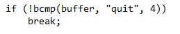
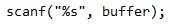
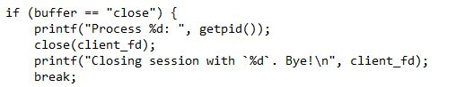

    Nama		        : Rakha Putra Pratama
    NRP		        : 3122600005
    Kelas		        : 2 D4 IT A
    Mata Kuliah	        : Konsep Jaringan
    Dosen Pengampu	        : Dr. Ferry Astika Saputra S.T., M.Sc

# CONNECTION TERMINATION

## **Quit (Penutupan Penuh - Full Close)**

   - Saat client menerima pesan "quit" dari server, client akan keluar dari loop dan mengakhiri program. Ini berarti client akan menutup koneksi sepenuhnya (full close).
   - Penutupan penuh ini mengindikasikan bahwa client tidak akan mengirim atau menerima data lagi melalui koneksi tersebut, dan sumber daya jaringan akan dibebaskan setelah program client berakhir.
   - Ini adalah cara yang umum digunakan untuk mengakhiri koneksi secara aman ketika pengguna memutuskan untuk keluar dari program.

## **Close (Penutupan Setengah - Half Close):**

   - Ketika client mengetikkan "close" dan mengirimkannya ke server, client hanya mengirim pesan "close" ke server melalui koneksi. Koneksi itu sendiri tidak akan ditutup sepenuhnya oleh client, tetapi hanya sisi pengiriman data (half close) dari sisi client.
   - Ini berarti client masih dapat menerima respons atau pesan lain dari server melalui koneksi tersebut, tetapi client tidak akan mengirim pesan lebih lanjut ke server melalui koneksi tersebut.

   - Kode di sisi server akan mendeteksi pesan "close" dan menutup koneksi dari sisi server, sehingga koneksi menjadi setengah tertutup (half closed) dari sisi server. Server tidak lagi akan mengirim data ke client melalui koneksi tersebut.
   - Koneksi akan tetap terbuka dari sisi client sampai client juga menutupnya secara eksplisit atau sampai terjadi kesalahan pada koneksi.

## Kesimpulan

Dalam kedua kasus di atas, penting untuk memahami bahwa koneksi dapat ditutup baik dari sisi client maupun server. Penutupan setengah (half close) adalah cara untuk mengindikasikan bahwa satu sisi tidak akan lagi mengirim data, tetapi masih akan menerima data, sementara penutupan penuh (full close) mengindikasikan bahwa koneksi akan sepenuhnya ditutup, dan tidak ada lagi data yang dapat ditransfer melalui koneksi tersebut.

Implementasi penutupan ini akan bervariasi tergantung pada bahasa pemrograman dan jenis soket yang digunakan, tetapi pemahaman tentang konsep penutupan setengah dan penutupan penuh akan membantu dalam mengelola koneksi dengan baik dalam pemrograman soket.