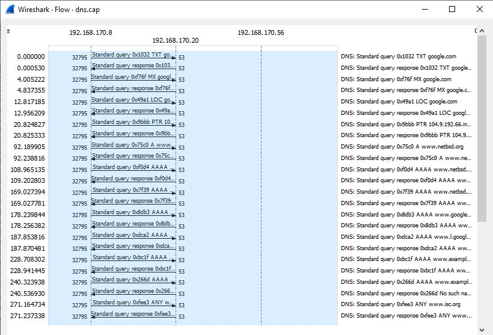

    Nama		        : Rakha Putra Pratama
    NRP		        : 3122600005
    Kelas		        : 2 D4 IT A
    Mata Kuliah	        : Konsep Jaringan
    Dosen Pengampu	        : Dr. Ferry Astika Saputra S.T., M.Sc

# DNS

## **Apa itu DNS (Domain Name System)?**

DNS adalah singkatan dari Domain Name System. Ini adalah protokol yang digunakan di internet untuk menghubungkan nama domain (seperti www.google.com) ke alamat IP (seperti 172.217.168.100) yang sesuai. DNS adalah komponen penting dalam infrastruktur internet karena memungkinkan pengguna untuk mengakses situs web dan layanan online dengan menggunakan nama domain yang mudah diingat, alih-alih harus mengingat alamat IP numerik yang rumit.

## **Cara Kerja DNS:**

DNS bekerja dengan cara berikut:

- **Permintaan DNS:** Ketika Anda memasukkan nama domain ke dalam browser web atau aplikasi, perangkat Anda akan mengirim permintaan DNS ke server DNS lokal atau server DNS yang ditentukan.
- **Caching DNS:** Server DNS lokal akan memeriksa apakah itu memiliki informasi tentang nama domain yang diminta dalam cache-nya. Jika ada, maka alamat IP akan dikembalikan tanpa melakukan permintaan ke server DNS lain.
- **Rekursi atau Iterasi:** Jika informasi tidak ada dalam cache lokal, server DNS akan melakukan satu atau lebih dari tiga hal berikut:
  - Melakukan pencarian rekursif: Server DNS lokal akan mencari informasi dari server DNS lain, mulai dari root DNS server, top-level domain (TLD) server, dan akhirnya server DNS otoritatif untuk domain yang diminta. Hasil pencarian akan disimpan dalam cache untuk digunakan nanti.
  - Melakukan pencarian iteratif: Server DNS lokal akan bertanya kepada server DNS lain secara berurutan, dan server DNS lain akan memberikan petunjuk ke server berikutnya yang harus ditanya hingga informasi ditemukan atau permintaan ditolak.
- **Balasan DNS:** Setelah informasi alamat IP ditemukan, server DNS akan mengirimkannya kembali ke perangkat pengguna. Dari sini, perangkat dapat menggunakan alamat IP ini untuk membuat koneksi dengan server yang dituju.

## **Analisis Flowgraph dari dns.cap pada Wireshark:**

<strong>Gambar:</strong> dns-flow-graph

### Tahap Permintaan DNS (UDP):

1. **Pengguna Menginisiasi Permintaan DNS (UDP):**

   - Pada tahap ini, pengguna ingin mengakses suatu situs web atau layanan online menggunakan nama domain, seperti "www.example.com". Namun, jaringan komputer beroperasi dengan menggunakan alamat IP numerik. Oleh karena itu, pengguna menginisiasi permintaan DNS.

2. **Paket Permintaan DNS Dibuat:**

   - Komputer pengguna membangun paket data yang berisi permintaan DNS. Paket ini akan mencakup informasi berikut:
     - **Nama Domain yang Diminta:** Dalam kasus ini, "www.example.com".
     - **Jenis Permintaan (Misalnya A atau AAAA):** Permintaan jenis A adalah untuk mencari alamat IPv4, sementara AAAA digunakan untuk mencari alamat IPv6 (yang memiliki alamat IP yang lebih panjang).

3. **Pengguna Mengirim Paket Permintaan DNS:**

   - Pengguna mengirimkan paket permintaan DNS melalui protokol UDP ke server DNS. UDP digunakan di sini karena ini adalah metode komunikasi yang lebih cepat dan lebih ringan daripada TCP, yang tidak memerlukan pembukaan dan penutupan koneksi terpisah.

### Tahap Respons DNS (UDP):

1. **Server DNS Menerima Permintaan:**

   - Server DNS menerima paket permintaan DNS dari komputer pengguna.

2. **Server DNS Memproses Permintaan:**

   - Server DNS mulai memproses permintaan. Langkah-langkah yang dilakukan oleh server DNS meliputi:
     - **Cek Caching:** Server DNS pertama-tama memeriksa apakah informasi yang diminta telah disimpan dalam cache dari permintaan sebelumnya. Jika ada, server akan mengembalikan respons dari cache tanpa perlu melanjutkan proses pencarian.
     - **Rekursif atau Iteratif:** Jika tidak ada dalam cache, server DNS akan memulai proses pencarian. Ini bisa menjadi rekursif, di mana server DNS akan mencari jawaban dari server lain sampai mendapatkan jawaban akhir, atau iteratif, di mana server DNS akan memberikan petunjuk ke server berikutnya yang harus ditanya.

3. **Server DNS Membuat Paket Respons DNS:**

   - Setelah menemukan alamat IP yang sesuai dengan nama domain yang diminta, server DNS membangun paket respons DNS. Paket ini akan mencakup informasi berikut:
     - **Alamat IP yang Sesuai:** Contohnya, alamat IPv4 seperti "192.168.1.1" atau alamat IPv6 yang lebih panjang.
     - **Nama Domain yang Diminta:** Ini untuk memastikan respons dikaitkan dengan permintaan DNS tertentu.
     - **Informasi Lain (Contohnya, Informasi TTL):** Informasi tambahan seperti TTL (Time To Live) mungkin juga disertakan.

4. **Server DNS Mengirimkan Paket Respons DNS:**

   - Server DNS mengirimkan paket respons DNS melalui protokol UDP kembali ke komputer pengguna.

### Kesimpulan:

Dengan menerima respons DNS yang berisi alamat IP yang sesuai dengan nama domain yang diminta, komputer pengguna sekarang memiliki informasi yang diperlukan untuk menginisiasi koneksi ke situs web atau layanan online yang diinginkan. Proses ini memungkinkan kita untuk menggunakan nama domain yang mudah diingat alih-alih harus mengingat alamat IP numerik yang rumit, dan ini adalah inti dari bagaimana DNS memfasilitasi penggunaan internet modern.
