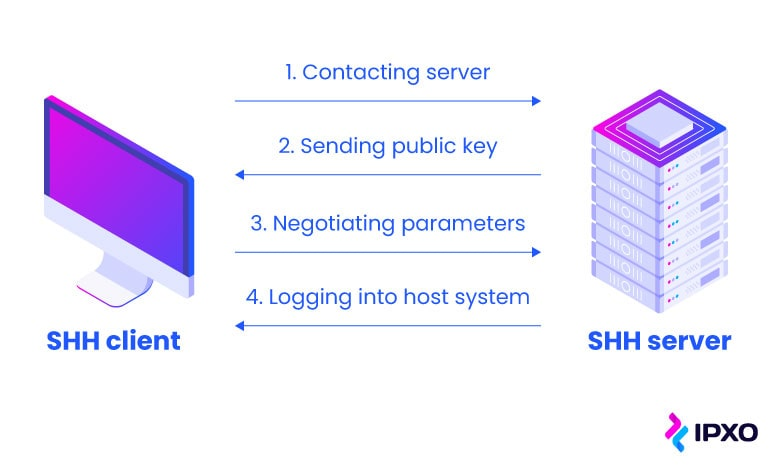

    Nama		        : Rakha Putra Pratama
    NRP		        : 3122600005
    Kelas		        : 2 D4 IT A
    Mata Kuliah	        : Konsep Jaringan
    Dosen Pengampu	        : Dr. Ferry Astika Saputra S.T., M.Sc

# SSH

<strong>Gambar:</strong> How does ssh work

## **Apa itu SSH (Secure Shell):**

SSH (Secure Shell) adalah protokol jaringan yang digunakan untuk mengakses dan mengelola perangkat jarak jauh dan komputer melalui jaringan yang tidak aman, seperti internet. Ini adalah cara yang aman untuk mengendalikan perangkat dan melakukan transfer data dengan mengenkripsi lalu lintas jaringan, sehingga melindungi kerahasiaan dan integritas informasi. SSH menyediakan lingkungan yang aman untuk menjalankan perintah, mengelola file, dan mengakses aplikasi jarak jauh.

## **Apa itu RFC (Request for Comments)**

RFC adalah singkatan dari "Request for Comments." Ini adalah serangkaian dokumen yang digunakan dalam dunia teknologi informasi dan komunikasi, terutama dalam pengembangan standar dan protokol internet. Dokumen RFC berisi spesifikasi teknis, panduan, dan penjelasan terkait dengan berbagai aspek internet, termasuk protokol, format data, dan praktik terbaik. RFC digunakan oleh komunitas teknis untuk mendefinisikan dan mengembangkan standar terbuka yang digunakan di seluruh dunia.

## **Versi SSH**

SSH telah mengalami beberapa versi seiring berjalannya waktu. Beberapa versi yang paling dikenal adalah SSH-1 dan SSH-2:

- **SSH-1:** Versi SSH awal yang memiliki beberapa masalah keamanan yang kemudian diatasi dalam versi SSH-2. Meskipun masih digunakan dalam beberapa kasus, SSH-1 dianggap kurang aman dibandingkan SSH-2.

- **SSH-2:** Ini adalah versi SSH yang lebih canggih dan aman. SSH-2 mendefinisikan sejumlah perbaikan keamanan dan peningkatan performa dibandingkan SSH-1, dan saat ini menjadi standar yang lebih umum digunakan dalam implementasi SSH.

## **Karakteristik SSH**

Karakteristik utama dari SSH mencakup:

- **Enkripsi:** SSH menggunakan enkripsi untuk melindungi data yang dikirim antara perangkat, sehingga data tetap rahasia bahkan jika disadap.

- **Otentikasi Kuat:** SSH memerlukan otentikasi pengguna yang kuat. Ini dapat mencakup metode otentikasi dengan kata sandi atau, yang lebih aman, penggunaan kunci SSH.

- **Portabilitas:** SSH dapat digunakan di berbagai sistem operasi dan arsitektur, menjadikannya protokol yang sangat portabel.

- **Kontrol Akses:** SSH memungkinkan pengguna untuk mengendalikan akses ke perangkat jarak jauh dengan menentukan siapa yang diizinkan untuk masuk.

- **Forwarding Port:** SSH juga mendukung fitur port forwarding, yang memungkinkan pengguna untuk mengirim lalu lintas dari satu port lokal ke port lain di perangkat jarak jauh atau sebaliknya.

## Bagaimana SSH Bekerja?

**SSH Client Menghubungi Server**

Ketika seorang klien SSH ingin terhubung ke server SSH, proses dimulai dengan mengidentifikasi alamat IP atau nama host dari server tersebut. Klien SSH kemudian menginisiasi permintaan koneksi ke server dengan menggunakan alamat tersebut, mirip dengan cara kita menghubungi nomor telepon seseorang ketika kita ingin berbicara dengan mereka. Permintaan koneksi ini dikirimkan melalui jaringan menuju server.

**SSH Server Mengirimkan Kunci Publik**

Setelah server menerima permintaan koneksi dari klien, server akan merespons dengan mengirimkan kunci publiknya kepada klien. Kunci publik ini adalah bagian dari pasangan kunci kriptografi yang digunakan dalam proses enkripsi SSH. Ini adalah langkah awal dalam proses autentikasi yang aman. Klien menerima kunci publik ini dari server.

**Klien SSH Menegosiasikan Parameter**

Setelah menerima kunci publik dari server, klien SSH dan server SSH mulai bernegosiasi tentang parameter-parameter koneksi. Ini termasuk metode enkripsi yang akan digunakan, metode otentikasi (seperti kata sandi atau kunci SSH), dan parameter lain yang relevan untuk sesi SSH. Klien dan server harus setuju pada parameter-parameter ini untuk memastikan komunikasi yang aman dan efisien.

**Server SSH Masuk ke Sistem Host**

Setelah negosiasi parameter selesai dan klien serta server telah mencapai kesepakatan, klien akan mengirimkan otentikasi (misalnya, kata sandi atau kunci SSH) sebagai bukti identitas kepada server. Server akan memverifikasi otentikasi ini dan memutuskan apakah klien memiliki izin untuk masuk ke sistem host atau tidak. Jika otentikasi berhasil, server akan memberikan akses kepada klien untuk menjalankan perintah atau mengakses layanan yang tersedia di sistem host. Ini adalah langkah terakhir dalam proses koneksi SSH.

Keseluruhan proses ini memastikan bahwa komunikasi antara klien dan server terenkripsi, aman, dan otentikasi pengguna dilakukan dengan baik untuk melindungi integritas sistem host. SSH adalah alat yang sangat penting dalam mengelola perangkat jarak jauh dan menjaga keamanan dalam lingkungan jaringan modern.

**Kesimpulan:**

SSH (Secure Shell) adalah protokol yang sangat penting dalam dunia komputasi dan jaringan, yang memberikan akses jarak jauh yang aman, pengelolaan perangkat, dan transfer data terenkripsi. Dengan enkripsi data, otentikasi yang kuat, dan portabilitas, SSH menjadi standar de facto untuk mengelola perangkat jarak jauh dan menjaga keamanan dalam lingkungan jaringan modern. Protokol ini terus berkembang melalui dokumen RFC dan implementasi baru untuk memenuhi kebutuhan yang berkembang dalam dunia teknologi.
