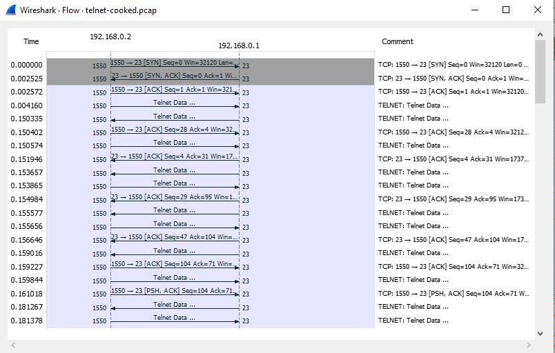

    Nama		        : Rakha Putra Pratama
    NRP		        : 3122600005
    Kelas		        : 2 D4 IT A
    Mata Kuliah	        : Konsep Jaringan
    Dosen Pengampu	        : Dr. Ferry Astika Saputra S.T., M.Sc

# TELNET

## **Apa itu Telnet?**

Telnet adalah protokol komunikasi jarak jauh yang digunakan untuk mengakses atau mengendalikan perangkat atau komputer dari jarak jauh melalui jaringan, seperti internet atau jaringan lokal. Ini adalah salah satu protokol tertua yang digunakan untuk akses jarak jauh dan sering digunakan untuk mengelola perangkat jarak jauh seperti server, router, switch, atau komputer lain yang terhubung ke jaringan. Selain itu, Telnet juga adalah nama dari perangkat lunak yang digunakan untuk menjalankan protokol ini.

## **Cara Kerja Telnet**

Cara kerja Telnet dapat dijelaskan sebagai berikut:

- **Inisiasi Koneksi:** Pengguna yang ingin mengakses perangkat atau komputer dari jarak jauh melalui Telnet memulai dengan membuka program Telnet di komputer lokal mereka. Mereka kemudian menentukan alamat IP atau nama host dari perangkat yang ingin mereka akses.

- **Permintaan Koneksi:** Setelah alamat tujuan ditentukan, perangkat Telnet di komputer pengguna akan mengirim permintaan koneksi ke perangkat yang dituju melalui jaringan.

- **Persetujuan Koneksi:** Perangkat yang dituju akan menerima permintaan koneksi Telnet dan, jika diizinkan, akan membuka sesi Telnet dengan komputer pengguna. Ini memungkinkan pengguna untuk berinteraksi dengan perangkat tersebut sebagai jika mereka berada di depannya.

- **Interaksi dan Pengendalian:** Setelah sesi Telnet dibuka, pengguna dapat memasukkan perintah dan menerima respons dari perangkat jarak jauh tersebut. Dalam sesi Telnet, komunikasi yang dikirim antara komputer pengguna dan perangkat jarak jauh adalah dalam bentuk teks, sehingga pengguna dapat menjalankan perintah, mengelola file, atau melakukan operasi lain sesuai dengan perangkat tersebut.

- **Penutupan Sesi:** Setelah pengguna selesai dengan sesi Telnet, mereka dapat mengakhiri sesi tersebut dengan menggunakan perintah tertentu atau hanya dengan menutup jendela Telnet di komputer mereka. Sesi Telnet kemudian akan ditutup, dan koneksi jarak jauh akan diputuskan.

- **Keamanan:** Penting untuk dicatat bahwa Telnet tidak aman secara default karena data yang dikirimkan antara komputer pengguna dan perangkat jarak jauh tidak dienkripsi. Ini berarti bahwa informasi sensitif dapat dipantau oleh pihak yang tidak berwenang jika mereka memiliki akses ke jaringan. Oleh karena itu, untuk tujuan keamanan, lebih disarankan untuk menggunakan protokol komunikasi jarak jauh yang lebih aman seperti SSH (Secure Shell) jika memungkinkan.

## Flowgraph

<strong>Gambar:</strong> telnet-flow-graph

_Dari flowgraph di atas dapat dilihat bahwa yang pertama kali melakukan SYN adalah 192.168.0.2_
